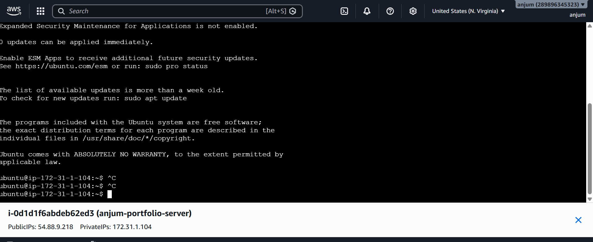
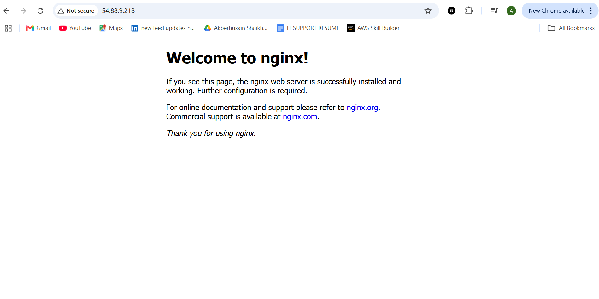
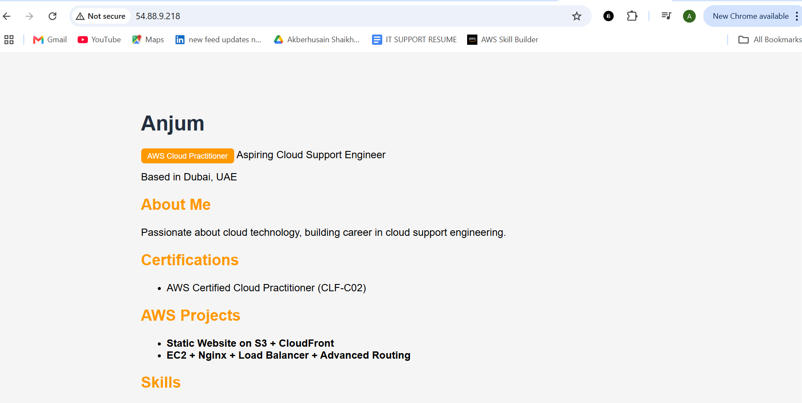
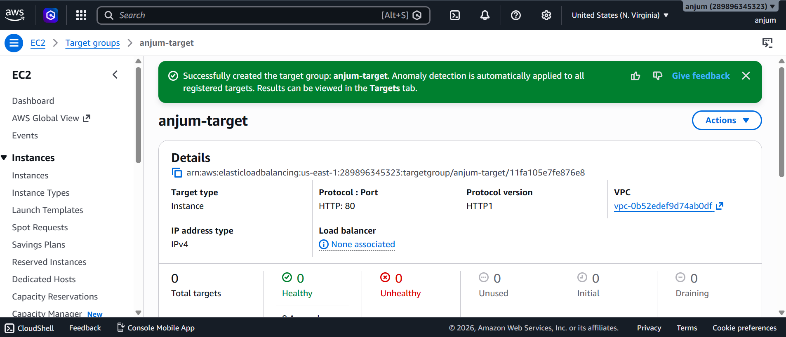
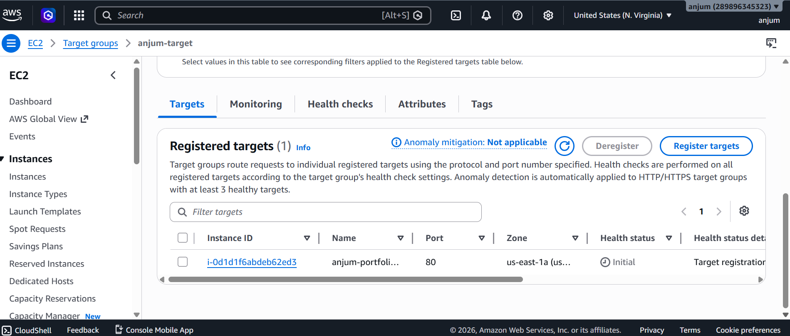
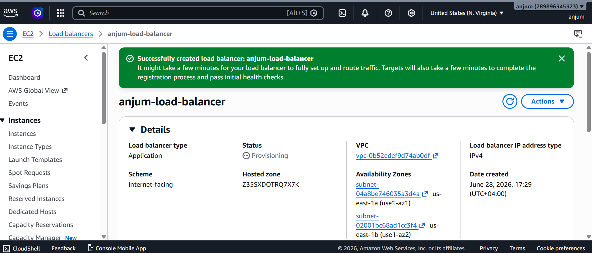
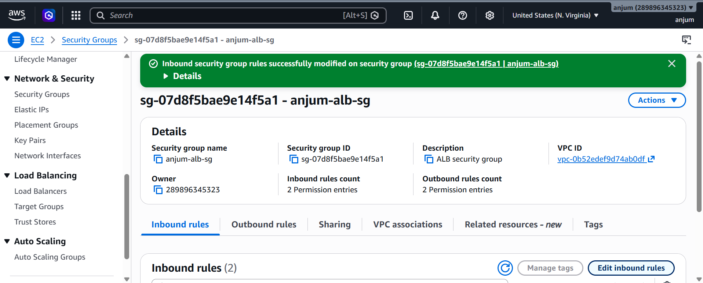
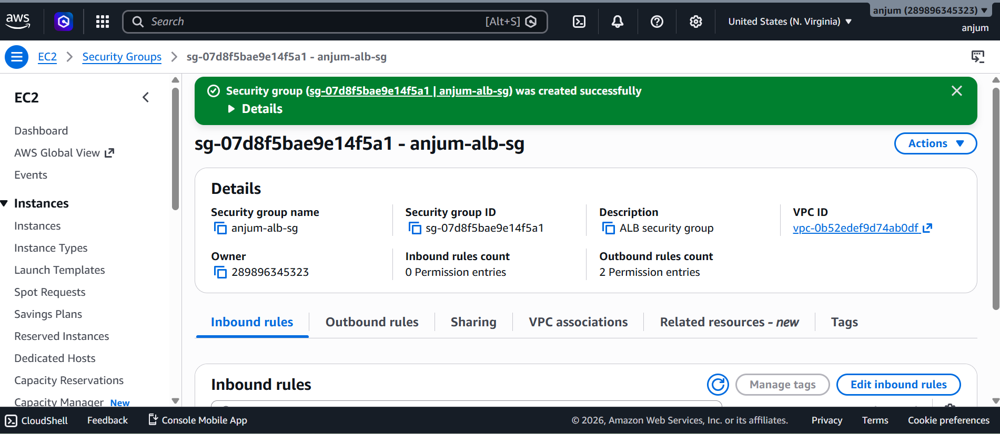
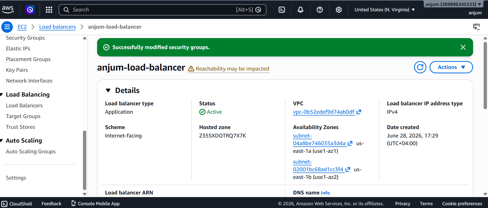
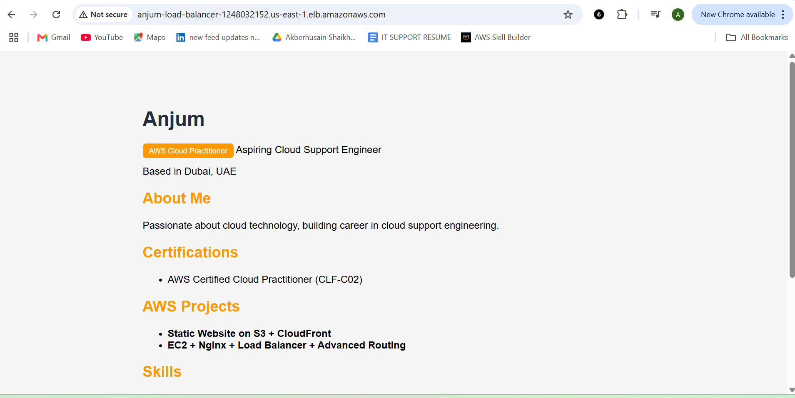

# 🚀 Project 2 — EC2 + Nginx + Application Load Balancer


> **Author:** Anjum Mohammed — AWS Cloud Practitioner | Aspiring Cloud Support Engineer | Dubai, UAE

---

## 📋 Overview

This project demonstrates deploying a portfolio website on AWS using **EC2**, **Nginx**, and an **Application Load Balancer (ALB)** with advanced request routing. It is the second project in my AWS cloud portfolio, building on [Project 1 — Static Website on S3 + CloudFront](https://d2wrsh5icek6ta.cloudfront.net).

---

## 🏗️ Architecture

```
Internet
    │
    ▼
Application Load Balancer (anjum-load-balancer)
    │   Internet-facing | HTTP:80 | us-east-1
    │   Availability Zones: us-east-1a, us-east-1b
    │
    ▼
Target Group (anjum-target)
    │   Protocol: HTTP | Port: 80 | Health Check: /
    │
    ▼
EC2 Instance (anjum-portfolio-server)
    │   Ubuntu 22.04 LTS | t2.nano | us-east-1a
    │   Elastic IP: 54.88.9.218
    │
    ▼
Nginx Web Server
    │   Serving portfolio website on port 80
    │
    ▼
Portfolio Website (HTML/CSS)
```

---

## ⚙️ AWS Services Used

| Service | Purpose |
|---|---|
| EC2 (t2.nano) | Virtual server to host the web application |
| Nginx | Web server to serve HTML content |
| Application Load Balancer | Distribute traffic with advanced routing |
| Target Groups | Register EC2 instances for ALB routing |
| Elastic IP | Static public IP for EC2 instance |
| VPC & Subnets | Network isolation across 2 public subnets |
| Security Groups | Firewall rules for EC2 and ALB |
| Internet Gateway | Enable internet access for VPC |
| Route Tables | Route traffic to internet gateway |

---

## 🔧 Step-by-Step Setup

### Step 1 — Launch EC2 Instance

- **AMI:** Ubuntu 22.04 LTS
- **Instance type:** t2.nano
- **Region:** us-east-1 (N. Virginia)
- **Subnet:** anjum-public-subnet (us-east-1a)
- **Elastic IP:** 54.88.9.218

**Security Group Inbound Rules:**

| Type | Port | Source |
|---|---|---|
| SSH | 22 | 0.0.0.0/0 |
| HTTP | 80 | 0.0.0.0/0 |
| HTTPS | 443 | 0.0.0.0/0 |

---

### Step 2 — Connect via EC2 Instance Connect

Used AWS Console → EC2 → Connect → EC2 Instance Connect (browser-based terminal).


*EC2 Instance Connect — `ubuntu@ip-172-31-1-104` connected successfully*

---

### Step 3 — Install and Configure Nginx

```bash
# Update packages
sudo apt update -y

# Install Nginx
sudo apt install nginx -y

# Start Nginx and enable on boot
sudo systemctl start nginx
sudo systemctl enable nginx

# Verify Nginx is running
sudo systemctl status nginx
```


*Nginx welcome page live at `http://54.88.9.218` ✅*

---

### Step 4 — Deploy Portfolio Website

```bash
sudo bash -c 'cat > /var/www/html/index.html << EOF
<!DOCTYPE html>
<html lang="en">
<head>
  <meta charset="UTF-8">
  <title>Anjum — Cloud Support Engineer</title>
  <style>
    body { font-family: Arial, sans-serif; max-width: 800px; margin: 50px auto; padding: 20px; }
    h2 { color: #ff9900; }
    .badge { background: #ff9900; color: white; padding: 5px 10px; border-radius: 5px; }
  </style>
</head>
<body>
  <h1>Anjum</h1>
  <p><span class="badge">AWS Cloud Practitioner</span> Aspiring Cloud Support Engineer</p>
  <p>Based in Dubai, UAE</p>
</body>
</html>
EOF'
```


*Portfolio website live at `http://54.88.9.218` ✅*

---

### Step 5 — Configure VPC and Networking

Created 2 public subnets required for ALB:

| Subnet | Availability Zone | CIDR |
|---|---|---|
| anjum-public-subnet | us-east-1a | 172.31.1.0/24 |
| anjum-public-subnet-2 | us-east-1b | 172.31.2.0/24 |

Both subnets route to internet gateway `igw-0b73fc0d72d45677d`.

---

### Step 6 — Create Target Group

- **Name:** anjum-target
- **Protocol:** HTTP | **Port:** 80
- **Health check path:** `/`
- **Registered target:** anjum-portfolio-server (`i-0d1d1f6abdeb62ed3`)


*Target group `anjum-target` created successfully ✅*


*EC2 instance registered as a target on port 80 ✅*

---

### Step 7 — Create Application Load Balancer

- **Name:** anjum-load-balancer
- **Scheme:** Internet-facing | **IP type:** IPv4
- **Availability Zones:** us-east-1a, us-east-1b
- **Listener:** HTTP:80 → Forward to `anjum-target` (100%)
- **DNS:** `anjum-load-balancer-1248032152.us-east-1.elb.amazonaws.com`


*Application Load Balancer created — provisioning ✅*


*ALB status: **Active** ✅*

---

### Step 8 — Create ALB Security Group

- **Name:** anjum-alb-sg
- **ID:** sg-07d8f5bae9e14f5a1

| Type | Port | Source |
|---|---|---|
| HTTP | 80 | 0.0.0.0/0 |
| HTTPS | 443 | 0.0.0.0/0 |


*ALB security group `anjum-alb-sg` created ✅*


*Inbound rules applied — HTTP & HTTPS open to internet ✅*

---

## 🏆 Final Result — Portfolio via ALB DNS


*Portfolio website accessible via ALB DNS — `anjum-load-balancer-1248032152.us-east-1.elb.amazonaws.com` 🏆*

---

## 🌐 Live URLs

| URL | Description |
|---|---|
| `http://54.88.9.218` | Direct EC2 IP |
| `http://anjum-load-balancer-1248032152.us-east-1.elb.amazonaws.com` | Via Application Load Balancer |

---

## 🛠️ Troubleshooting

### ❌ Issue — Site Not Loading After ALB Setup

**Symptom:** After creating the Application Load Balancer and target group, the portfolio website was not loading when accessed via the ALB DNS URL. The browser just timed out with no response.

**Root Cause:** The security group attached to the target group did not have inbound rules for HTTP (port 80) or HTTPS (port 443). Without these rules, the ALB had no way to forward incoming traffic to the EC2 instance — all requests were being silently dropped at the network level.

**How I Diagnosed It:**
- Confirmed the EC2 instance itself was working by accessing it directly via its Elastic IP (`http://54.88.9.218`) — the portfolio loaded fine
- Confirmed the ALB was Active and the target group showed the EC2 as registered
- Noticed the security group on the target group had **0 inbound permission entries** — the missing piece

**Fix:**
Edited the inbound rules of the security group (`anjum-alb-sg`) to add:

| Type | Protocol | Port | Source |
|---|---|---|---|
| HTTP | TCP | 80 | 0.0.0.0/0 |
| HTTPS | TCP | 443 | 0.0.0.0/0 |


*Inbound rules added to `anjum-alb-sg` — HTTP & HTTPS now open ✅*

**Result:** The portfolio immediately loaded via the ALB DNS URL after saving the rules.


*Site live via ALB — `anjum-load-balancer-1248032152.us-east-1.elb.amazonaws.com` 🏆*

---

### ✅ Lesson Learned

> **Security groups act as firewalls at every layer.** Even if your EC2 instance and ALB are both running correctly, traffic will not flow unless the security group explicitly allows it. Always check inbound rules first when a site is not loading — it's the most common cause.

---

## 💡 Key Learnings

- Launching and configuring an EC2 instance on AWS
- Installing and managing Nginx web server on Ubuntu
- Configuring VPC, subnets, internet gateway, and route tables
- Creating and configuring an Application Load Balancer with target groups
- Managing security groups for both EC2 and ALB
- Troubleshooting connectivity (subnet routing, security groups)
- Using EC2 Instance Connect as an alternative to SSH

---

## 💰 Cost Optimization Tips

- Use **t2.micro** (free tier) instead of t2.nano for 12 months free
- **Stop EC2** when not in use to avoid compute charges
- **Delete ALB** when done — ALB charges per hour (~$16–20/month if left running)
- **Release Elastic IP** when not attached to an instance

---

## 📁 Related Projects

| Project | Description | Link |
|---|---|---|
| Project 1 | Static Website on S3 + CloudFront | [View](https://d2wrsh5icek6ta.cloudfront.net) |
| Project 2 | EC2 + Nginx + ALB + Advanced Routing | This repo |

---

## 👤 Author

**Anjum Mohammed**
AWS Cloud Practitioner | Aspiring Cloud Support Engineer
📍 Dubai, UAE
📧 anjumasif060@gmail.com
🔗 [LinkedIn](https://www.linkedin.com/in/anjum-mohammed-3a36141a6/)
💻 [GitHub](https://github.com/anjumasif123)

---

*Hosted on AWS EC2 + Application Load Balancer*
